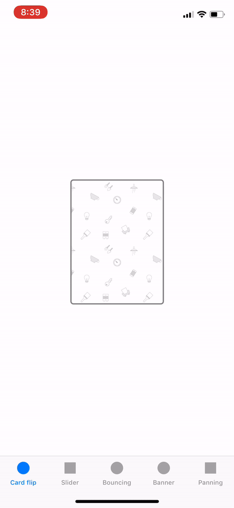
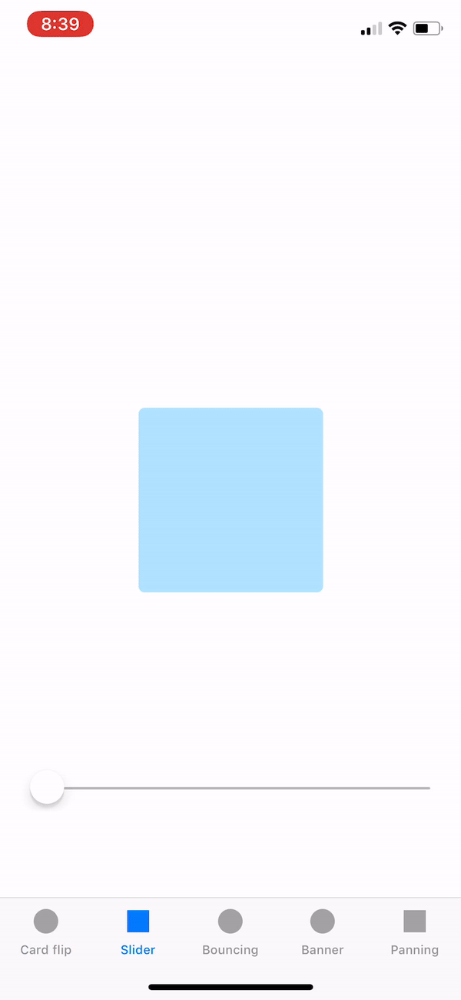
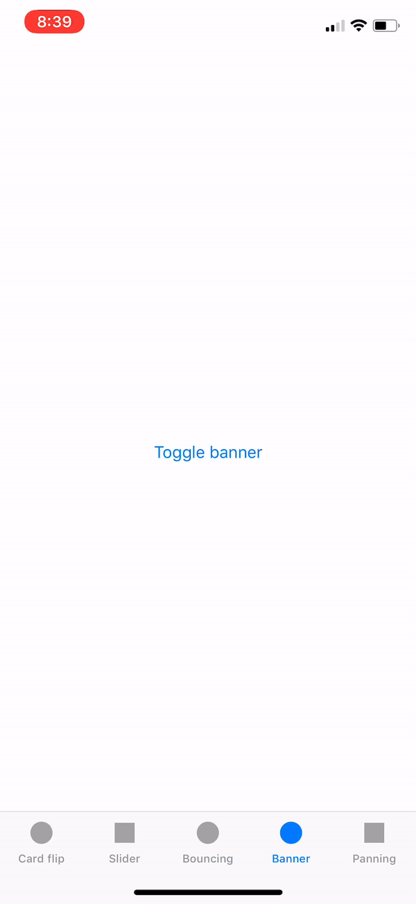

# SimpleAnimations1

## Card flipping


```
func animate() {
    if isOpen {
        initialState()
        UIView.transition(with: self, duration: 0.3, options: .transitionFlipFromLeft, animations: {
            self.transform = CGAffineTransform.identity
            self.superview?.backgroundColor = .white
        }, completion: nil)
    } else {
        finalState()
        UIView.transition(with: self, duration: 0.3, options: .transitionFlipFromRight, animations: {
            self.transform = CGAffineTransform.init(scaleX: 1.75, y: 1.75)
            self.superview?.backgroundColor = .lightGray
        }, completion: nil)
    }
    
    isOpen = !isOpen
}

func animate(by fraction: CGFloat) {
    viewAnimator.fractionComplete = fraction
}

func initialState() {
    setImage(#imageLiteral(resourceName: "backCard"), for: .normal)
    imageView?.contentMode = .scaleAspectFill
}

func finalState() {
    backgroundColor = .pastelYellow
    setImage(#imageLiteral(resourceName: "frontCard"), for: .normal)
    imageView?.contentMode = .scaleAspectFit
}

func setupAnimator() {
    viewAnimator = UIViewPropertyAnimator(duration: 0.3, dampingRatio: 0.9, animations: {
        self.finalState()
        
    })
    
    viewAnimator.pausesOnCompletion = true
}
```

## Slider


```
func animate() {
    viewAnimator.startAnimation()
}

func animate(by fraction: CGFloat) {
    viewAnimator.fractionComplete = fraction
}

func initialState() {
    viewAnimator = UIViewPropertyAnimator(duration: 1, dampingRatio: 1, animations: {
        self.finalState()
    })
    viewAnimator.pausesOnCompletion = true
}

func finalState() {
    backgroundColor = .pastelGreen
    transform = CGAffineTransform(rotationAngle: CGFloat.pi - 1)
    layer.cornerRadius = bounds.width / 2
}
```

## Bouncing button

```
func animate() {
    viewAnimator.startAnimation()
}

func setupAnimator() {
    viewAnimator = UIViewPropertyAnimator(duration: 0.6, dampingRatio: 0.9, animations: {
        self.transform = CGAffineTransform.init(scaleX: 1.5, y: 1.5)
    })
    
    viewAnimator.addAnimations {
        self.transform = CGAffineTransform.identity
    }
}
```
## Banner


```
func animate() {
    isReversed = isShown
    viewAnimator.startAnimation()
    isShown = !isShown
}

func animate(by fraction: CGFloat) {
    viewAnimator.fractionComplete = fraction
}

func initialState() {
    bottomConstraint.constant = 0
}

func finalState() {
    bottomConstraint.constant = bannerHeight + borderWidtch + view.safeAreaInsets.top
}

func setupAnimator() {
    viewAnimator = UIViewPropertyAnimator(duration: 0.25, curve: .easeOut) {
        self.finalState()
        self.view.layoutIfNeeded()
    }
    
    viewAnimator.pausesOnCompletion = true
}
```
